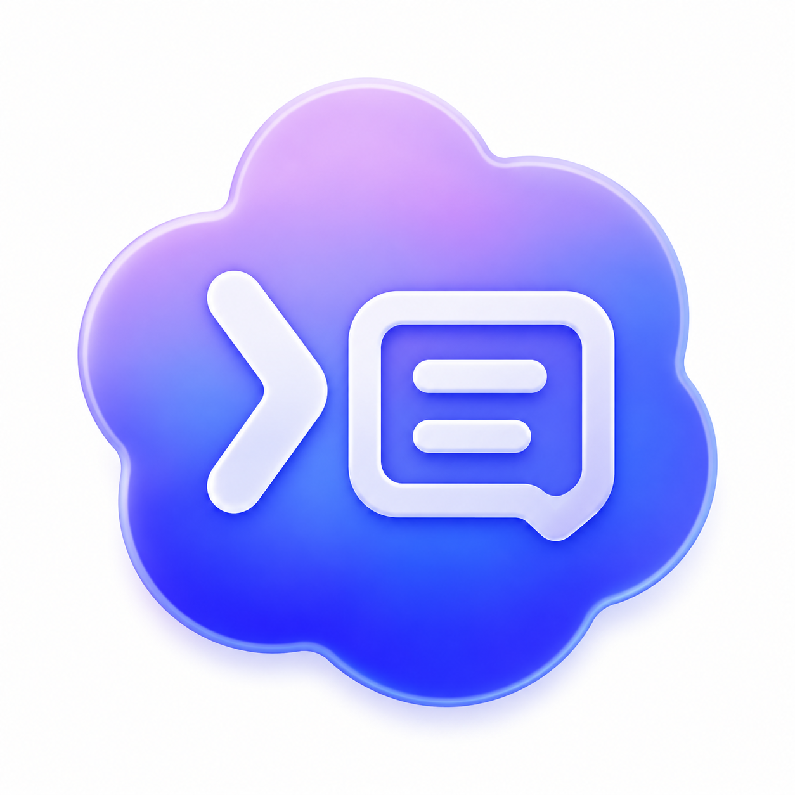

# Codex Manager

[涓枃璇存槑](README-浣跨敤璇存槑.md)

A local conversation manager for Codex Desktop. It helps you inspect, organize, back up, import, export, and manage locally stored Codex conversations.

> The application name in Chinese is **Codex 瀵硅瘽绠＄悊鍣?*.

## Features

- Scan and classify local Codex conversations
- Browse normal, sub-agent, archived, residual, damaged, and duplicate conversations
- View conversation details and original file paths
- Export conversations to Markdown
- Back up selected conversations
- Import one or more `.jsonl` conversation files
- Generate a new ID when an imported conversation ID already exists
- Synchronize conversations between API-login and account-login modes
- Delete selected local conversations after Codex is fully closed
- Exit or restart Codex from the manager
- Build Windows and macOS releases

## Platforms

- Windows: WPF application and installer
- macOS Apple Silicon: Avalonia app bundle
- macOS Intel: Avalonia app bundle

## Build

Requires .NET 8. Use the included scripts:

    .\tools\run-tests.ps1
    .\tools\publish-windows.ps1
    .\tools\package-macos.ps1

## Data Safety

This project manages local Codex data only. Before importing, deleting, or synchronizing conversations, fully exit Codex so it cannot rewrite local indexes during the operation.

Back up important conversations before destructive operations.

## License

See [LICENSE](LICENSE).
